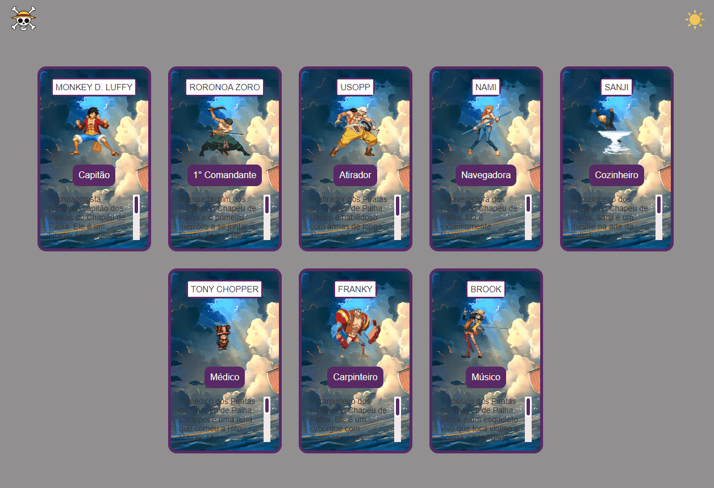

# README Projeto Mugiwara One-Piece
### Um projeto com arquivo README 🚀

Este projeto foi realizado baseado em uma maratona que participei chamada "Do Zero ao Programador contratado" 

[]

(https://pedroaraujooliveira.github.io/projeto-mugiwara-onepiece/)

## Tecnologias utilizadas
- HTML
- CSS
- JS

